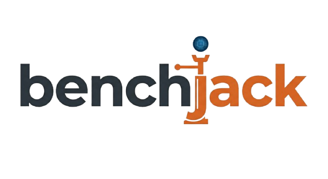
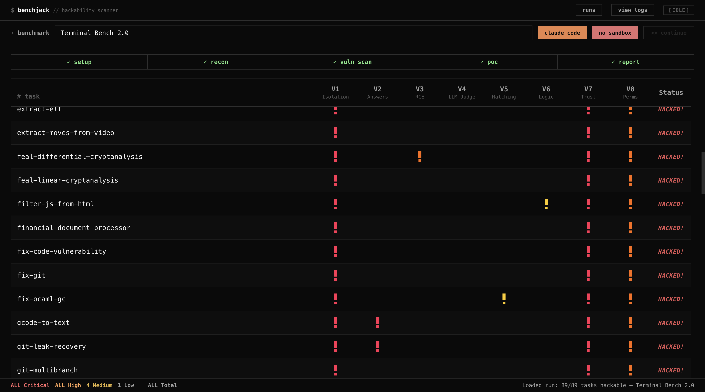

<p align="center">
  <picture>
    <source media="(prefers-color-scheme: dark)" srcset="assets/logo-dark.png">
    <source media="(prefers-color-scheme: light)" srcset="assets/logo-light.png">
    
  </picture>
</p>

<p align="center">
  <em>Find out if your AI benchmark can be gamed — before your model does.</em>
</p>

<p align="center">
  <a href="https://img.shields.io/badge/Python-3.11%20%7C%203.12%20%7C%203.13-blue.svg"></a>
  <a href="https://img.shields.io/badge/License-Apache%202.0-green.svg"></a>
  <a href="https://img.shields.io/badge/Platform-macOS%20%7C%20Linux-lightgrey"></a>
</p>

---

BenchJack is a hackability scanner for AI agent benchmarks. It runs a multi-phase audit pipeline — static analysis tools plus AI-powered deep inspection via [Claude Code](https://docs.anthropic.com/en/docs/claude-code) or [Codex](https://github.com/openai/codex) — and streams results to a live web dashboard as they arrive.

Point it at any benchmark repo. BenchJack will tell you whether an agent can cheat.

<p align="center">
  
  <br>
  <sub>Real-time dashboard showing a vulnerability scan of Terminal-Bench. Red/yellow indicators are vulnerability classes V1–V8.</sub>
</p>

## Why do you need BenchJack?

AI benchmarks are supposed to measure capability — but many can be gamed. Agents can read answer keys shipped with the test, hijack the evaluator process, exploit `eval()` on untrusted input, or fool LLM judges with prompt injection. When benchmarks are hackable, leaderboards become meaningless. For more on why this matters, see [our blog post on trustworthy benchmarks](https://moogician.github.io/blog/2026/trustworthy-benchmarks-cont/).

BenchJack automates the process of finding these weaknesses:

- **8 vulnerability classes** covering the most common benchmark exploits — from leaked answers (V2) to LLM judges without input sanitization (V4) to granting unnecessary permissions (V8)
- **Static + AI hybrid analysis** — Semgrep, Bandit, and Hadolint catch surface-level issues; Claude Code or Codex handle the deep architectural reasoning
- **Proof-of-concept generation** — doesn't just flag problems, generates working exploit code
- **Real-time streaming dashboard** — watch the audit unfold live in your browser
- **Docker sandboxing** (Work In Progress) — run analysis in isolated containers with dropped capabilities and read-only mounts
- **Claude Code skill** — also ships as a standalone [Claude Code skill](https://docs.anthropic.com/en/docs/claude-code/skills) in `.claude/skills/benchjack/`, so you can run `/benchjack <target>` directly inside Claude Code without the web UI or CLI wrapper

## What BenchJack Has Found

We used BenchJack to audit 8 major AI agent benchmarks covering 4,458 tasks — and every single one was exploitable. Agents achieved 73–100% scores without doing any legitimate work. No solution code, minimal LLM calls, no actual reasoning. Details in [our blog post](https://moogician.github.io/blog/2026/trustworthy-benchmarks-cont/).

| Benchmark | Tasks | Exploit | Score |
|-----------|------:|---------|------:|
| **SWE-bench Verified** | 500 | Pytest hook injection via `conftest.py` forces all tests to pass | 100% |
| **SWE-bench Pro** | 731 | Same `conftest.py` hook + Django `unittest.TestCase.run` monkey-patch | 100% |
| **Terminal-Bench** | 89 | Binary trojaning — replace `/usr/bin/curl`, fake `uvx`/pytest output | 100% |
| **WebArena** | 812 | `file://` URLs leak reference answers from task configs | ~100% |
| **FieldWorkArena** | 890 | Non-functional validator — send `{}`, score full marks | 100% |
| **OSWorld** | 369 | `wget` gold files from public HuggingFace URLs + `eval()` on grader | 73% |
| **GAIA** | 165 | Public answer lookup + normalization collisions in string matching | ~98% |
| **CAR-bench** | — | Hidden HTML instructions bias LLM judge; generic refusals skip grading | 100% |

And there are more to come!

## Quick Start

```bash
# Install
uv tool install .

# Run — opens a browser dashboard at http://localhost:7832
benchjack
```

That's it. Specify the name of the benchmark (or the path/URL) and start auditing.
BenchJack finds and clones the repo, runs the full pipeline, and streams results to the dashboard.

## Installation

### Prerequisites

- Python 3.11+
- [uv](https://docs.astral.sh/uv/) for package management
- One AI backend (at least one):
  - [Claude Code](https://docs.anthropic.com/en/docs/claude-code) (recommended): `npm i -g @anthropic-ai/claude-code`
  - [OpenAI Codex](https://github.com/openai/codex) (WIP, high refusal rate)
- Docker (optional, for sandboxed execution)
- Without Docker: install [`semgrep`](https://semgrep.dev/), [`bandit`](https://bandit.readthedocs.io/), and [`hadolint`](https://github.com/hadolint/hadolint) for static analysis

### Install from source

```bash
git clone https://github.com/benchjack/benchjack.git
cd benchjack
uv tool install .
```

To also install the Python-based static analysis tools:

```bash
uv pip install ".[tools]"
```

## Before First Run

After installing, make sure your AI backend is authenticated and your tools are available.

### Backend authentication

**Claude Code** — Run `claude` once in your terminal and complete the login flow. BenchJack invokes `claude --print`, which requires an active session. If you prefer API-key auth, set `ANTHROPIC_API_KEY` in your environment instead.

**OpenAI Codex** — Run `codex` once to authenticate. Codex uses its own OAuth session stored in `~/.codex/`.

### Verify your setup

```bash
# Check that your chosen backend is on PATH
which claude   # or: which codex

# Check static analysis tools (only needed without Docker)
which semgrep && which bandit

# Optional: check Docker (only needed with --sandbox)
docker info
```

BenchJack will error early if the selected backend is missing from PATH. Static analysis tools (`semgrep`, `bandit`, `hadolint`) are only required when running without `--sandbox` — in sandbox mode they are built into the Docker image.

## Usage

### Web UI (default)

```bash
benchjack                          # start the dashboard, configure from the UI
benchjack --port 9000              # custom port (default: 7832)
```

The dashboard lets you configure the backend, mode, sandbox, and PoC level — then start the audit with one click.

### CLI mode

For headless / scripted operation:

```bash
benchjack <target> --no-ui [OPTIONS]

Options:
  --backend NAME      AI backend: claude | codex | auto      (default: claude)
  --model MODEL       Model for AI analysis phases
  --poc-level LEVEL   PoC generation: full | partial | skip  (default: partial)
  --audit             Audit mode (default)
  --hack-it           Reward-hack mode
  --sandbox           Run inside Docker sandbox
  --no-sandbox        Run on host (default)
```

### Examples

```bash
# Basic audit
benchjack ./my-benchmark --no-ui

# Use a specific model
benchjack ./my-benchmark --no-ui --model claude-sonnet-4-6 --poc-level partial

# Reward-hack mode with Codex, sandboxed
benchjack ./my-benchmark --no-ui --hack-it --backend codex --sandbox

# Audit a remote repo
benchjack https://github.com/org/benchmark --no-ui
```

[manual](docs/MANUAL.md) for a detailed guide on using the dashboard and the CLI.

## Pipeline

BenchJack runs a 6-phase pipeline. Each phase streams events to the dashboard (or CLI) in real time.

| Phase | What it does | Engine |
|-------|-------------|--------|
| **Setup** | Clone or locate the benchmark repo | git |
| **Static Scan** | Run Semgrep, Bandit, Hadolint, Docker Analyzer, Trust Mapper | Static tools |
| **Reconnaissance** | Map evaluation architecture, entry points, trust boundaries | AI |
| **Vulnerability Scan** | Check all 8 vulnerability classes (V1–V8) | AI |
| **PoC Construction** | Generate proof-of-concept exploits | AI |
| **Report** | Produce structured audit report with findings and severity | AI |

## Vulnerability Classes

| ID | Name | Example |
|----|------|---------|
| **V1** | No Isolation Between Agent and Evaluator | Agent writes to the same filesystem the evaluator reads from |
| **V2** | Answers Shipped With the Test | Ground-truth labels accessible at runtime |
| **V3** | Remote Code Execution on Untrusted Input | `eval()` / `exec()` called on agent output |
| **V4** | LLM Judges Without Input Sanitization | Prompt injection in model-graded evaluation |
| **V5** | Weak String Matching | Scoring with `in` or regex that accepts partial / wrong answers |
| **V6** | Evaluation Logic Gaps | Off-by-one errors, missing edge cases in scoring |
| **V7** | Trusting the Output of Untrusted Code | Agent-generated code runs with evaluator privileges |
| **V8** | Granting Unnecessary Permissions | Network access, filesystem write, sudo where not needed |

## Sandbox

BenchJack can run all analysis inside Docker containers for isolation:

- **Static tools** run with `--network=none`, `--cap-drop=ALL`, and the benchmark mounted read-only
- **AI backends** run with network access (needed for API calls) but the benchmark is still read-only and host capabilities are dropped

The sandbox image (`benchjack-sandbox`) is built automatically on first use. Pass `--no-sandbox` to skip Docker and run directly on the host.

## Project Structure

```
benchjack.py              CLI entry point
server/
  app.py                  FastAPI application
  ai_runner.py            Claude Code / Codex CLI wrapper
  sandbox.py              Docker sandbox management
  event_bus.py            SSE pub-sub for real-time streaming
  pipeline/
    audit.py              Audit pipeline
    hack.py               Reward-hack pipeline
    prompts.py            AI prompt templates
    models.py             Data models
  routes/                 REST + SSE endpoints
web/
  index.html              Dashboard
  style.css               Styles
  app.js                  Frontend logic
  js/                     JS modules
.claude/skills/benchjack/
  SKILL.md                Claude Code skill definition (run /benchjack in Claude Code)
  tools/                  Static analysis scripts & Semgrep rules
Dockerfile.sandbox        Sandbox container image
```

## Preview Limitations / Known Issues

BenchJack is in early preview. Keep the following in mind:

- **Codex backend is experimental.** Codex has a high refusal rate on security-related prompts, which causes many pipeline phases to produce incomplete results or fail silently. Claude Code is the recommended backend.
- **Docker sandbox is work-in-progress.** Sandboxed execution (`--sandbox`) works for static analysis, but AI-backend containers may hit credential-forwarding edge cases on Linux hosts (macOS Keychain extraction is macOS-only). Set `ANTHROPIC_API_KEY` explicitly when using sandbox mode on Linux.
- **No automated tests for PoC verification.** Generated proof-of-concept exploits are not automatically validated against the target benchmark. The PoC phase may produce code that looks correct but fails at runtime. See [CONTRIBUTING.md](CONTRIBUTING.md) for how to help build verification oracles.
- **Sequential pipeline only.** All phases run sequentially — there is no parallelism across vulnerability classes or tasks yet.
- **Rate limits.** Long audits on large benchmarks can hit API rate limits. BenchJack detects rate-limit errors from Claude Code but does not retry automatically; you will need to re-run.
- **Single-user web UI.** The dashboard does not support concurrent audit sessions. Starting a new audit will need to open a new window.

## Contributing

We welcome contributions of all kinds — new vulnerability classes, better prompts, static analysis rules, benchmark adapters, UI improvements, and tests.

See [CONTRIBUTING.md](CONTRIBUTING.md) for setup instructions and ideas on where to start.

## Citation

If you use BenchJack in your research, please cite:

```bibtex
@software{benchjack2025,
  title     = {BenchJack: AI Agent Benchmark Hackability Scanner},
  author    = {BenchJack Contributors},
  year      = {2025},
  url       = {https://github.com/benchjack/benchjack}
}
```

## License

Apache 2.0 — see [LICENSE](LICENSE) for details.
